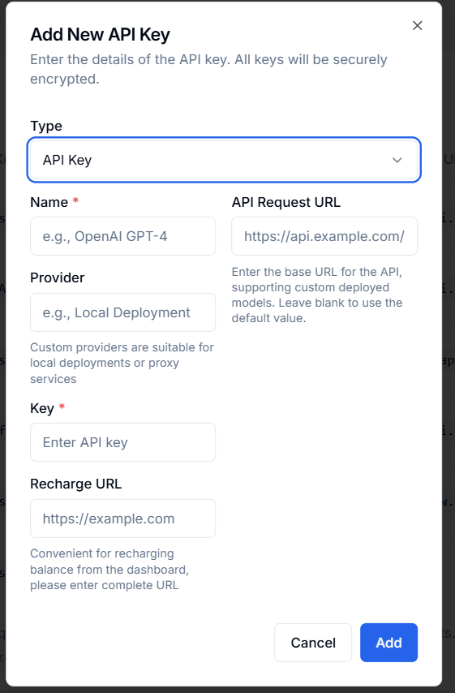
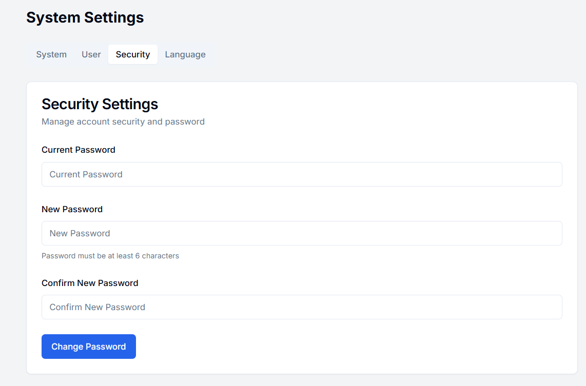

# API Key Manager

<p align="center">
 
</p>

<p align="center">
 <a href="README.md">English</a> | 
 <a href="README_CN.md">简体中文</a>
</p>

A secure and efficient API key management system that helps developers and teams easily manage API keys for various AI models.

## Preface
The API Key Manager aims to provide AI developers and enterprises with a one-stop solution for API key management. In today's diverse AI service environment, managing API keys from multiple providers is both cumbersome and poses security risks. This system helps users efficiently organize and utilize various service keys through secure encrypted storage, status monitoring, and convenient management features, reducing the risk of leakage and improving development efficiency. The system employs local storage technology, ensuring your sensitive key information is not uploaded to the cloud, further enhancing data security and privacy protection. Whether you are an individual developer or an enterprise user, the API Key Manager can meet your API key management needs. Of course, not only can it manage AI-related keys, but other related keys can also be uniformly managed using this manager.

## ✨ Features

- [x] 🔑 **API Key Management**: Securely store and manage API keys from multiple AI service providers
- [x] 🔒 **Security Encryption**: Protect your API keys with advanced encryption technology
- [x] ⚡ **Status Monitoring**: Monitor API key connection status in real time
- [x] 🌐 **Multi-language Support**: Switch between Chinese and English interfaces
- [x] ⚙️ **Custom Settings**: Customize system settings and preferences according to your needs
- [x] 🔄 **Connection Testing**: Test API connections directly from the dashboard
- [ ] 📊 **Usage Monitoring**: Monitor API key usage and token consumption (Coming soon)

## 📋 Table of Contents

- [Features](#-features)
- [Demo](#-demo)
- [Installation](#-installation)
   - [Vercel Deployment](#vercel-deployment)
   - [Local Installation](#local-installation)
   - [Docker Deployment](#docker-deployment)
- [Usage](#-usage)
- [Configuration](#-configuration)

## 📸 Demo

Visit our [demo site](https://www.a888.online) to experience the application.

API Key Management Page: Key Overview


Adding Keys: Basic Key + Composite Key

 

Dashboard: Monitor Connection Status


System Settings: Password Changes and Other Operations




Default login credentials:
- Username: `admin`
- Password: `password`

After logging in, it is recommended to change the password and remember it for long-term use.

## 📥 Installation

### Vercel Deployment

Deploying the NanMeng API Key Manager with Vercel is the simplest method:

1. Fork this repository to your GitHub account
2. Sign up or log in to [Vercel](https://vercel.com)
3. Click "New Project" and import your forked repository
4. Configure the following environment variables:
   - `ENCRYPTION_KEY`: A secure random string for encrypting API keys
   - `ALLOW_REGISTRATION`: Set to "true" or "false" to enable/disable user registration (registration feature has been deprecated)
5. Click "Deploy"

[](https://vercel.com/new/clone?repository-url=https%3A%2F%2Fgithub.com%2Fyourusername%2Fapi-key-manager)

### Local Installation

#### Prerequisites

- Node.js 18.x or higher
- npm or yarn
- Git

#### Steps

1. Clone the repository:
```bash
git clone https://github.com/randomAndre/api-key-manager.git
cd api-key-manager
```
  2. **Install Dependencies**

```bash
npm install
# or
yarn install
```


3. **Environment Setup**

Create a `.env.local` file in the root directory with the following variables:

```plaintext
ENCRYPTION_KEY=your-secure-random-string
```


4. **Development Mode**

To run the application in development mode:

```bash
npm run dev
# or
yarn dev
```

The application will be available at `http://localhost:3000`.


5. **Production Build**

To create a production build:

```bash
npm run build
npm start
# or
yarn build
yarn start
```


6. ### Docker Deployment

You can also deploy using Docker:

```bash
# Build the Docker image
docker build -t nanmeng-api-key-manager .

# Run the container
docker run -p 3000:3000 -e ENCRYPTION_KEY=your-secure-key -e ALLOW_REGISTRATION=false nanmeng-api-key-manager
```


## 🚀 Usage

### First-time Setup

1. Access the application using the default credentials:
   - 用户名: `admin`
   - 密码: `password`

2. After logging in, go to the Settings page and change the default password.


### Managing API Keys

1. Navigate to the "API Keys" section from the dashboard.

2. Click "Add Key" to add a new API key.

3. Fill in the required information:

   - Name: Descriptive name for the key
   - Provider: Service provider (e.g., OpenAI, Anthropic)
   - Key Type: Simple API key or Composite key
   - API Key: Your actual API key Additional fields for Composite key (AppID, Secret Key)
   - Base URL: API endpoint URL (default values for known providers)
   - Billing URL: Link to the provider's billing page (recommended)

4. To test a key's connection, use the "Test" button on the dashboard.

   Note: Not only AI keys, but all related keys can be configured and stored.


## ⚠️ Security Recommendations

1. Change the default admin password immediately after first login.
2. Use a strong, unique `ENCRYPTION_KEY` for production deployments.
3. If self-hosting, ensure your server has HTTPS enabled.
4. Regularly backup your data.
5. Regularly rotate your API keys to minimize risk.
6. Store sensitive information such as API keys and encryption keys in environment variables.


## 🛠️ Configuration

### Environment Variables

| Variable         | Description                      | Default  |
| ---------------- | -------------------------------- | -------- |
| `ENCRYPTION_KEY` | Key used for encrypting API keys | Required |


### Language Settings

The application supports English and Chinese. Users can switch languages using the language selector in the interface.

## Contributing

We welcome contributions from the community! To contribute, please follow these steps:

1. Fork the repository.
2. Create a new branch (`git checkout -b feature-branch`).
3. Make your changes and commit them (`git commit -m 'Add new feature'`).
4. Push to the branch (`git push origin feature-branch`).
5. Create a new Pull Request.
