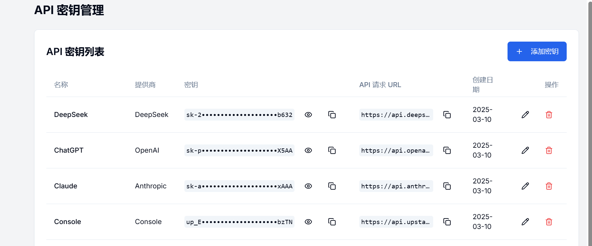

# API密钥管理器

<p align="center">
 
</p>

<p align="center">
 <a href="README.md">English</a> | 
 <a href="README_CN.md">简体中文</a>
</p>

一个安全且高效的API密钥管理系统，帮助开发者和团队轻松管理各种AI模型的API密钥。一键充值/测试连接

## ✨ 功能

- [x] 🔑 **API密钥管理**: 安全地存储和管理来自多个AI服务提供商的API密钥
- [x] 🔒 **安全加密**: 使用高级加密技术保护您的API密钥
- [x] 📊 **状态监控**: 实时监控API密钥的连接状态
- [x] 🌐 **多语言支持**: 在中文和英文界面之间切换
- [x] ⚙️ **自定义设置**: 根据您的需求自定义系统设置和偏好
- [x] 🔄 **连接测试**: 直接从仪表盘测试API连接
- [ ] 📊 **使用监控**: 监控API密钥的使用量和token消耗（待开发）

## 📋 目录

- [功能](#-功能)
- [演示](#-演示)
- [安装](#-安装)
  - [Vercel部署](#vercel部署)
  - [本地安装](#本地安装)
  - [Docker部署](#docker部署)
- [使用](#-使用)
- [配置](#-配置)

## 🚀 演示

访问我们的[演示站点](https://www.a888.online)体验应用程序。

密钥管理页面：密钥总览



添加密钥：基础密钥 + 复合密钥


仪表盘：监控连接情况


系统设置：密码更改等操作


默认登录凭据：

- 用户名: `admin`
- 密码: `password`

登录后若需长期使用建议更改密码并记住密码

## 📥 安装

### Vercel部署

使用Vercel部署API密钥管理器是最简单的方法：

1. 将此仓库 fork 到您的 GitHub 账户
2. 注册或登录 [Vercel](https://vercel.com)
3. 点击 "New Project" 并导入您的 forked 仓库
4. 配置以下环境变量：
   - `ENCRYPTION_KEY`: 用于加密API密钥的安全随机字符串
   - `ALLOW_REGISTRATION`: 设置为 "true" 或 "false" 以启用/禁用用户注册，注册功能已经弃用
5. 点击 "Deploy"

[](https://vercel.com/new/clone?repository-url=https%3A%2F%2Fgithub.com%2Fyourusername%2Fapi-key-manager)

### 本地安装

#### 前提条件

- Node.js 18.x 或更高版本
- npm 或 yarn
- Git

#### 步骤

1. **克隆仓库**：

```bash
git clone https://github.com/randomAndre/api-key-manager.git
cd api-key-manager
```
2. **安装依赖**

```bash
npm install
# 或
yarn install
```


3. **环境设置**

在根目录创建一个`.env.local`文件，包含以下变量：

```plaintext
ENCRYPTION_KEY=your-secure-random-string
```


4. **开发模式**

要在开发模式下运行应用程序：

```bash
npm run dev
# 或
yarn dev
```

应用程序将在`http://localhost:3000`上可用。


5. **生产构建**

要创建生产构建：

```bash
npm run build
npm start
# 或
yarn build
yarn start
```

### **Docker部署（可选）**

您也可以使用Docker部署：

```bash
# 构建Docker镜像
docker build -t nanmeng-api-key-manager .

# 运行容器
docker run -p 3000:3000 -e ENCRYPTION_KEY=your-secure-key -e ALLOW_REGISTRATION=false nanmeng-api-key-manager
```


## 使用指南

### 首次设置

1. 使用默认凭据访问应用程序：
   - 用户名: `admin`
   - 密码: `password`

2. 登录后，转到设置页面并更改默认密码。


### 管理API密钥

1. 从仪表板导航到"API密钥"部分。

2. 点击"添加密钥"添加新的API密钥。

3. 填写所需信息：

   名称：密钥的描述性名称
   提供商：服务提供商（OpenAI、Anthropic等）
   密钥类型：简单API密钥或复合密钥
   API密钥：您的实际API密钥
   复合密钥的附加字段（AppID、Secret Key）
   基础URL：API端点URL（为已知提供商提供默认值）
   充值URL：提供商的账单页面链接（建议填写）

4. 要测试密钥的连接，请使用仪表板上的"测试"按钮。

   注：不止是AI密钥，所有相关密钥皆可配置存储


### 安全建议

1. 首次登录后立即更改默认管理员密码。
2. 为生产部署使用强大且唯一的`ENCRYPTION_KEY`。
3. 如果自托管，确保您的服务器启用了HTTPS。
4. 定期备份您的数据。
5. 定期更换您的API密钥以降低风险。
6. 使用环境变量存储敏感信息，如API密钥和加密密钥。

## 配置选项

### 环境变量

| 变量             | 描述                  | 默认值 |
| ---------------- | --------------------- | ------ |
| `ENCRYPTION_KEY` | 用于加密API密钥的密钥 | 必填   |

## 语言设置

应用程序支持中文和英文。用户可以使用界面中的语言选择器切换语言。

## 贡献

我们欢迎社区的贡献！要贡献，请按照以下步骤操作：

1. Fork 仓库。
2. 创建一个新分支 (`git checkout -b feature-branch`)。
3. 进行更改并提交 (`git commit -m 'Add new feature'`)。
4. 推送到分支 (`git push origin feature-branch`)。
5. 创建一个新的 Pull Request。